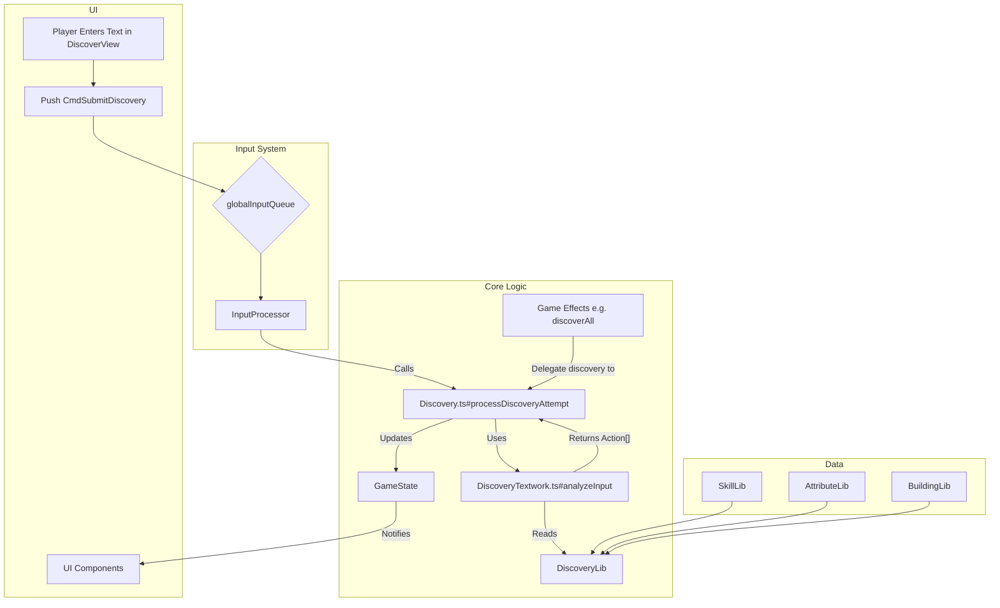

# Discovery Feature Implementation Plan

## 1. Overall Feature Description

This document outlines the plan for implementing a "Discovery" system. The goal is to create an engaging exploration and deduction mechanic where the player uncovers game concepts not by just clicking on them in a list, but by thinking about what they might be and typing in related words.

The player will interact with an input field in the "Discover" tab. When they submit text, one of two things can happen:

1.  **Direct Discovery:** If the player types the exact name of a skill, building, or other game item (e.g., "Melee Combat"), that item is immediately discovered. A message appears in the game log ("Skill Discovered: 'Melee Combat'. +10xp"), and the player gains experience.

2.  **Keyword Discovery:** If the player types a single word that is a "keyword" associated with one or more undiscovered items (e.g., "sword" for "Melee Combat"), that word is added to a visible **Active Keywords** list in the UI.
    *   **Active Keywords** are words the player has found that still relate to at least one thing they haven't discovered yet.
    *   On the skill browser, undiscovered skills and specializations will display star icons (✨) corresponding to the number of *Active Keywords* the player has found that relate to them. These icons are drawn on top of the name (the name is obfuscated and unintelligible anyway).
    *   **Brainstorm Discovery:** When an item accumulates 5 related keywords (a threshold that will be a configurable stat), it is automatically discovered. The game log will show a special message: "Skill discovered: 'Navigation'. +10xp\nYou've brainstormed 5 keywords that relate to it: word1, word2, word3, word4, word5!"
    *   When an item is discovered (either directly or via brainstorm), the system re-evaluates all Active Keywords. Any keyword that no longer relates to any *undiscovered* items is removed from the Active list and moved to a "discarded" state, cleaning up the UI.

## 2. System Architecture & Information Flow

The architecture is split into a stateless "Textwork" module for analysis, a stateless "Discovery" logic module, a central "DiscoveryLib" for data aggregation, and the player input system. All state is stored in `GameState`.

*   **`src/logic/lib/DiscoveryLib.ts` (New):** This library will be the single source of truth for all *discoverable* items. It loads after other data libraries (`SkillLib`, `AttributeLib`) and aggregates their data. It will be responsible for managing keywords and creating efficient lookup indexes. Keyword data and augmentation logic from `SkillLib` will be moved here.
*   **`src/logic/DiscoveryTextwork.ts` (New):** A stateless module responsible for pure string analysis. It takes player input and returns a structured array of `DiscoveryAction`s based on `DiscoveryLib` data.
*   **`src/logic/Discovery.ts` (New):** A stateless module containing the core discovery logic. It will have functions to process discovery attempts from player input and to handle discoveries triggered by other game systems (e.g., events). It acts upon `GameState` but holds no internal state.
*   **`src/logic/input/InputCommands.ts` & `InputProcessor.ts` (Modification):** The existing input system will be used to pipe player text from the UI into the discovery system.
*   **`src/logic/GameState.ts` (Modified):** Holds the state, including the `discoveredItems` set, `activeKeywords` map, `discardedKeywords` set, and a structured `discoveryLog`.
*   **UI Components:** The UI will react to changes in `GameState`.

### Information Flow Diagram

## 3. Core Logic Details

### `DiscoveryLib.ts`
-   **Responsibility:** Aggregate all discoverable items and their keywords. Create fast lookups.
-   **Indexes:**
    -   `byId: Map<string, DiscoverableItem>`
    -   `bySearchableName: Map<string, DiscoverableItem>`
-   **Startup Verification:** During creation, it will verify that no discoverable item name consists of more than 2 words (after removing '&').
-   **Keywords:** Keyword data (augmentation, lookups) will be centralized here, moved from `SkillLib`.

### `DiscoveryTextwork.ts`
-   **Responsibility:** Stateless input analysis.
-   **Function:** `analyzeInput(input: string, discoveryLib: DiscoveryLib, gameState: GameState): DiscoveryAction[]`
-   **Logic:**
    -   Cleans input string.
    -   If 1 word: performs both direct name search and keyword search.
    -   If 2 words: performs direct name search.
    -   If >2 words: returns a mismatch/invalid action.
    -   Uses `gameState.isDiscovered()` to check if items/keywords are already discovered.

### `Discovery.ts`
-   **Responsibility:** Central hub for all discovery-related state changes.
-   **Functions:**
    -   `processDiscoveryAttempt(term: string, gameState: GameState)`: Main entry point from `InputProcessor`. It orchestrates the text analysis and applies the resulting actions to `GameState`.
    -   `discoverItem(itemId: string, method: 'direct' | 'brainstorm' | 'event', gameState: GameState, relatedKeywords?: string[])`: The **single, centralized function for discovering an item**. Any system (events, direct input, etc.) that needs to discover something must call this function. It handles:
        -   Adding the item to `GameState.discoveredItems`.
        -   Updating the keyword maps (`activeKeywords`, `discardedKeywords`).

## 4. Implementation Plan: Playable Steps

### Step 1: Foundational Logic & Data Structures
*   **Goal:** Create the core, non-UI data structures and libraries.
*   **Tasks:**
    1.  `GameState.ts` is already updated.
    2.  Create `src/types/discoveryTypes.ts` defining `DiscoverableItem`, `DiscoveryEvent`, and `DiscoveryAction` types.
    3.  Create `src/logic/lib/DiscoveryLib.ts`. Implement the aggregation from `SkillLib`, pre-calculation of `searchableName`, the two indexes (`byId`, `bySearchableName`), and the name word-count verification.
    4.  Create `src/logic/DiscoveryTextwork.ts` with the `analyzeInput` function. For this step, it should only implement the **direct name search** logic.
    5.  Create `src/logic/Discovery.test.ts`. Write unit tests for `DiscoveryLib`'s data aggregation and for `DiscoveryTextwork.ts`'s direct name matching.

### Step 2: Wire Input & Process Direct Discoveries
*   **Goal:** Allow a player to type an item's name and see it become discovered.
*   **Tasks:**
    1.  Add `CmdSubmitDiscovery` to `src/logic/input/InputCommands.ts`.
    2.  Create `src/logic/Discovery.ts`. Implement `processDiscoveryAttempt` and the `discoverItem` function. `processDiscoveryAttempt` will call `discoverItem` when its text analysis finds a direct match.
    3.  Modify all `discover` functions in `effects.ts` (e.g., `discover`, `discoverAllSkills`) to delegate their work by calling `Discovery.ts#discoverItem`. This centralizes all discovery logic.
    4.  Add `handleSubmitDiscovery` to `src/logic/input/InputProcessor.ts` which calls `Discovery.ts#processDiscoveryAttempt`.
    5.  In `DiscoverView.vue`, add the UI text input to push `CmdSubmitDiscovery` to the `globalInputQueue`.
    6.  Update `GameLog` to render `GameState.discoveryLog`.
*   **Testable Outcome:** A player can type "Melee Combat", press enter, and a "Skill Discovered: Melee Combat" message appears in the log. Typing it again does nothing. An event calling `discoverAllSkills` correctly registers all skills as discovered and updates keyword states properly.

### Step 3: Keyword Logic & UI
*   **Goal:** Implement the backend and frontend for the keyword accumulation system.
*   **Tasks:**
    1.  Modify `DiscoveryLib.ts` to also aggregate all keywords and create a keyword-to-item lookup. Move keyword augmentation and related structs from `SkillLib` to `DiscoveryLib`.
    2.  Flesh out `DiscoveryTextwork.ts#analyzeInput` to handle single-word keyword searches, generating `ADD_ACTIVE_KEYWORD` or `ADD_DISCARDED_KEYWORD` actions.
    3.  Extend `Discovery.ts#processDiscoveryAttempt` to handle these new keyword actions from the analysis, updating `GameState`.
    4.  Create and integrate the `ActiveKeywords.vue` UI component into `DiscoverView.vue`.
    5.  Update `Discovery.test.ts` to comprehensively test the keyword logic.
*   **Testable Outcome:** Player can type a keyword (e.g., "sword"). It appears in an "Active Keywords" list. When they later discover "Melee Combat", "sword" is correctly removed from the active list if it no longer applies to any other undiscovered skills.

### Step 4: Indirect Discovery & Finalization
*   **Goal:** Implement automatic discovery via keyword accumulation.
*   **Tasks:**
    1.  Refactor the discovery threshold (5) into an `IndependentStat`.
    2.  In `Discovery.ts`, after adding an active keyword, check the related undiscovered items. For each, count how many active keywords now point to it.
    3.  If an item meets the threshold, call `discoverItem` with the `brainstorm` method.
    4.  Generate the special "brainstorm" discovery message for the log inside `discoverItem`.
    5.  Update `SkillBrowser.vue` to display "stars" indicating the number of found keywords for each undiscovered item.
*   **Testable Outcome:** The full loop is playable. The player enters keywords, sees stars appear on skills, and at 5 stars, the skill automatically unlocks with a special message. 

## TODO:
*   **ResourceLib**